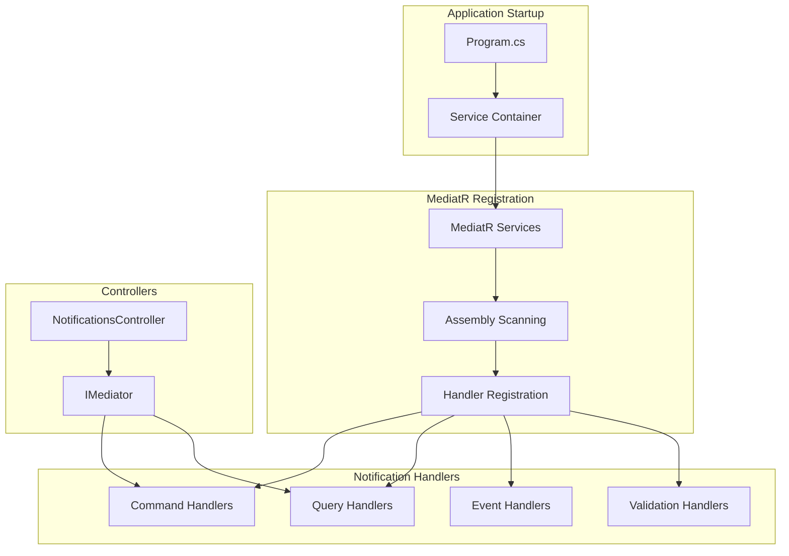

# Design Document: Notification Dependency Injection Fix

## Overview

This design addresses the critical dependency injection issue where MediatR is not registered in the ASP.NET Core service container, causing the NotificationsController to fail with "Unable to resolve service for type 'MediatR.IMediator'" errors. The solution involves properly registering MediatR services and ensuring all notification-related handlers are discoverable and registered in the dependency injection container.

## Architecture

The fix follows the standard ASP.NET Core dependency injection pattern with MediatR integration:



## Components and Interfaces

### MediatR Service Registration

**Core MediatR Services**
- `IMediator`: Main interface for sending commands and queries
- `IRequestHandler<TRequest, TResponse>`: Interface for command/query handlers
- `INotificationHandler<TNotification>`: Interface for domain event handlers
- `IPipelineBehavior<TRequest, TResponse>`: Interface for cross-cutting concerns

**Assembly Scanning Configuration**
```csharp
services.AddMediatR(cfg => {
    cfg.RegisterServicesFromAssembly(typeof(Program).Assembly);
    cfg.RegisterServicesFromAssembly(typeof(CRM.Application.AssemblyMarker).Assembly);
});
```

### Handler Discovery

**Command Handlers**
- `CreateNotificationCommandHandler`
- `MarkNotificationAsReadCommandHandler`
- `ArchiveNotificationsCommandHandler`
- `UpdateNotificationPreferencesCommandHandler`

**Query Handlers**
- `GetUserNotificationsQueryHandler`
- `GetUnreadNotificationCountQueryHandler`
- `GetNotificationPreferencesQueryHandler`
- `GetDispatchHistoryQueryHandler`

**Event Handlers**
- `QuotationSentEventHandler`
- `QuotationViewedEventHandler`
- `QuotationResponseReceivedEventHandler`
- `QuotationExpiringEventHandler`

## Data Models

### Service Registration Configuration

**MediatR Configuration**
```csharp
public static class MediatRServiceExtensions
{
    public static IServiceCollection AddMediatRServices(this IServiceCollection services)
    {
        services.AddMediatR(cfg =>
        {
            cfg.RegisterServicesFromAssembly(typeof(Program).Assembly);
            cfg.RegisterServicesFromAssembly(typeof(CRM.Application.AssemblyMarker).Assembly);
            cfg.AddBehavior(typeof(IPipelineBehavior<,>), typeof(ValidationBehavior<,>));
            cfg.AddBehavior(typeof(IPipelineBehavior<,>), typeof(LoggingBehavior<,>));
        });
        
        return services;
    }
}
```

**Service Lifetime Configuration**
- `IMediator`: Scoped (default MediatR registration)
- Handler instances: Transient (default MediatR registration)
- Pipeline behaviors: Transient (default MediatR registration)

## Correctness Properties

*A property is a characteristic or behavior that should hold true across all valid executions of a system-essentially, a formal statement about what the system should do. Properties serve as the bridge between human-readable specifications and machine-verifiable correctness guarantees.*

<function_calls>
<invoke name="prework">
<parameter name="featureName">notification-di-fix
#
## Property Reflection

After reviewing all properties identified in the prework, I've identified several areas where properties can be consolidated to eliminate redundancy:

**Consolidation Opportunities:**
- Properties 1.1, 1.2, and 2.1 (MediatR registration and handler discovery) can be combined into a comprehensive registration property
- Properties 2.2 and 2.3 (command and query handler support) can be combined into a general handler execution property
- Properties 4.1, 4.3, and 4.4 (logging behaviors) can be combined into comprehensive logging property
- Properties 1.5 and 3.3 (no dependency resolution errors) are essentially the same and can be combined

**Properties to Remove:**
- Properties 5.2, 5.3, and 5.5 are about code organization and style, not functional behavior

### Correctness Properties

Property 1: MediatR service registration and discovery
*For any* application startup, the system should register MediatR services and automatically discover all command, query, and event handlers from the application assemblies
**Validates: Requirements 1.1, 1.2, 2.1**

Property 2: Controller dependency resolution
*For any* NotificationsController instantiation, the system should successfully resolve the IMediator dependency without throwing exceptions
**Validates: Requirements 1.3**

Property 3: Command and query processing support
*For any* valid command or query sent through MediatR, the system should execute the appropriate handler and return the expected result
**Validates: Requirements 1.4, 2.2, 2.3**

Property 4: Event handler registration and execution
*For any* domain event published through MediatR, the system should execute all registered event handlers successfully
**Validates: Requirements 2.4**

Property 5: Validation pipeline behavior
*For any* invalid request sent through MediatR, the system should execute validation behaviors and return appropriate validation errors
**Validates: Requirements 2.5**

Property 6: No dependency resolution errors during operation
*For any* notification endpoint access or MediatR operation, the system should not throw dependency resolution exceptions
**Validates: Requirements 1.5, 3.3**

Property 7: Proper HTTP status codes for notification endpoints
*For any* request to notification endpoints, the system should return appropriate HTTP status codes (200, 401, 403) instead of 409 Conflict errors
**Validates: Requirements 3.1, 3.2, 3.4, 3.5**

Property 8: Comprehensive error logging
*For any* dependency resolution failure or service registration issue, the system should log detailed error information including service types and stack traces
**Validates: Requirements 4.1, 4.3, 4.4**

Property 9: Startup validation
*For any* application startup, the system should validate that all required notification services are properly registered and resolvable
**Validates: Requirements 4.5**

Property 10: Automatic handler discovery
*For any* new handler added to the application assembly, the system should automatically discover and register it without manual configuration
**Validates: Requirements 5.1**

Property 11: Backward compatibility preservation
*For any* existing notification functionality, the system should continue to work correctly after the dependency injection fix
**Validates: Requirements 5.4**

## Error Handling

### Dependency Resolution Failures
- **Missing Service Registration**: Clear error messages indicating which service type cannot be resolved
- **Circular Dependencies**: Detection and reporting of circular dependency chains
- **Assembly Loading Issues**: Graceful handling of assembly scanning failures with detailed logging

### MediatR Configuration Errors
- **Handler Registration Failures**: Validation that all expected handlers are registered during startup
- **Pipeline Behavior Issues**: Error handling for pipeline behavior registration and execution
- **Assembly Scanning Problems**: Fallback mechanisms when automatic discovery fails

### Runtime Resolution Issues
- **Controller Instantiation Failures**: Proper error responses when controllers cannot be created
- **Handler Execution Errors**: Appropriate exception handling and logging for handler failures
- **Service Lifetime Issues**: Detection and resolution of service lifetime mismatches

## Testing Strategy

### Unit Testing Approach
Unit tests will focus on individual service registration and resolution scenarios:
- **Service Container Configuration**: Verify MediatR services are registered correctly
- **Handler Discovery**: Test that specific handlers can be resolved from the container
- **Controller Instantiation**: Verify controllers can be created through dependency injection
- **Pipeline Behavior Registration**: Test that validation and logging behaviors are properly configured

### Property-Based Testing Approach
Property-based tests will verify universal behaviors across all MediatR operations using **FsCheck** for .NET:
- **Minimum 100 iterations** per property test to ensure comprehensive coverage
- **Custom generators** for commands, queries, and events to test handler execution
- **Service resolution testing** across different service types and configurations

Each property-based test will be tagged with comments referencing the design document:
- Format: `**Feature: notification-di-fix, Property {number}: {property_text}**`
- Example: `**Feature: notification-di-fix, Property 1: MediatR service registration and discovery**`

### Integration Testing
- **End-to-end notification workflows**: Test complete notification creation and retrieval flows
- **HTTP endpoint testing**: Verify notification API endpoints return correct status codes
- **Service container integration**: Test service resolution in realistic application scenarios
- **Error handling validation**: Verify proper error responses and logging behavior

### Performance Testing
- **Service resolution performance**: Measure dependency injection overhead
- **Handler execution timing**: Verify MediatR adds minimal performance impact
- **Memory usage validation**: Ensure no memory leaks in service registration
- **Startup time impact**: Measure effect of MediatR registration on application startup