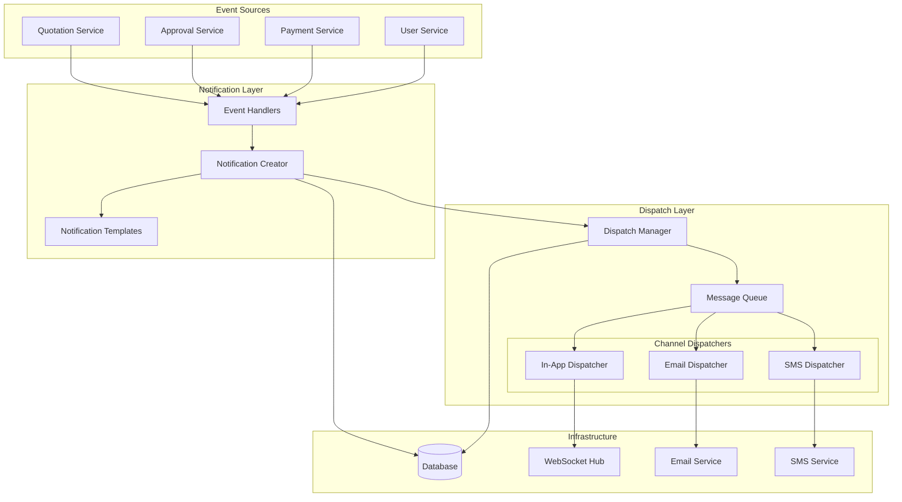

# Design Document: Notification Creation and Dispatch

## Overview

The Notification Creation and Dispatch system extends the existing notification entity model (Spec-025) to provide automated notification creation based on business events and multi-channel delivery capabilities. The system implements an event-driven architecture with asynchronous processing, retry mechanisms, and comprehensive delivery tracking.

## Architecture

The system follows a layered architecture with clear separation of concerns:



## Components and Interfaces

### Event Handling Layer

**INotificationEventHandler**
- Listens to domain events from business services
- Determines notification requirements based on event type
- Triggers notification creation with appropriate context

**NotificationEventHandlers**
- `QuotationStatusChangedHandler`: Handles quotation lifecycle events
- `ApprovalRequestHandler`: Handles approval workflow events
- `PaymentRequestHandler`: Handles payment-related events
- `UserManagementHandler`: Handles user account events

### Notification Creation Layer

**INotificationCreationService**
```csharp
public interface INotificationCreationService
{
    Task<NotificationDto> CreateNotificationAsync(CreateNotificationRequest request);
    Task<List<NotificationDto>> CreateBulkNotificationsAsync(List<CreateNotificationRequest> requests);
    Task<NotificationDto> CreateFromTemplateAsync(string templateKey, object templateData, List<int> recipientIds);
}
```

**INotificationTemplateService**
```csharp
public interface INotificationTemplateService
{
    Task<NotificationTemplate> GetTemplateAsync(string templateKey);
    Task<string> RenderTemplateAsync(string templateKey, object data, NotificationChannel channel);
    Task<NotificationTemplate> CreateTemplateAsync(CreateTemplateRequest request);
    Task UpdateTemplateAsync(int templateId, UpdateTemplateRequest request);
}
```

### Dispatch Management Layer

**INotificationDispatchService**
```csharp
public interface INotificationDispatchService
{
    Task DispatchNotificationAsync(int notificationId);
    Task<DispatchStatus> GetDispatchStatusAsync(int notificationId);
    Task RetryFailedDispatchAsync(int dispatchAttemptId);
    Task<List<DispatchAttempt>> GetDispatchHistoryAsync(int notificationId);
}
```

**Channel-Specific Dispatchers**
```csharp
public interface INotificationChannelDispatcher
{
    NotificationChannel Channel { get; }
    Task<DispatchResult> DispatchAsync(NotificationDispatchContext context);
    Task<bool> ValidateConfigurationAsync();
}
```

### Real-Time Communication

**INotificationHub**
```csharp
public interface INotificationHub
{
    Task SendNotificationToUser(int userId, NotificationDto notification);
    Task SendNotificationToGroup(string groupName, NotificationDto notification);
    Task UpdateNotificationStatus(int userId, int notificationId, bool isRead);
}
```

## Data Models

### Core Dispatch Entities

**NotificationDispatchAttempt**
```csharp
public class NotificationDispatchAttempt
{
    public int Id { get; set; }
    public int NotificationId { get; set; }
    public NotificationChannel Channel { get; set; }
    public DispatchStatus Status { get; set; }
    public DateTime AttemptedAt { get; set; }
    public DateTime? CompletedAt { get; set; }
    public string? ErrorMessage { get; set; }
    public string? ExternalReference { get; set; }
    public int RetryCount { get; set; }
    public DateTime? NextRetryAt { get; set; }
    
    // Navigation
    public Notification Notification { get; set; }
}
```

**NotificationTemplate**
```csharp
public class NotificationTemplate
{
    public int Id { get; set; }
    public string TemplateKey { get; set; }
    public string Name { get; set; }
    public string Description { get; set; }
    public NotificationChannel Channel { get; set; }
    public string Subject { get; set; }
    public string BodyTemplate { get; set; }
    public string? Variables { get; set; } // JSON array of required variables
    public bool IsActive { get; set; }
    public DateTime CreatedAt { get; set; }
    public DateTime UpdatedAt { get; set; }
}
```

**NotificationChannelConfiguration**
```csharp
public class NotificationChannelConfiguration
{
    public int Id { get; set; }
    public NotificationChannel Channel { get; set; }
    public bool IsEnabled { get; set; }
    public string Configuration { get; set; } // JSON configuration
    public int MaxRetryAttempts { get; set; }
    public TimeSpan RetryDelay { get; set; }
    public DateTime CreatedAt { get; set; }
    public DateTime UpdatedAt { get; set; }
}
```

### Enums

```csharp
public enum NotificationChannel
{
    InApp = 1,
    Email = 2,
    SMS = 3
}

public enum DispatchStatus
{
    Pending = 1,
    Processing = 2,
    Sent = 3,
    Failed = 4,
    Retrying = 5,
    PermanentlyFailed = 6
}
```

## Correctness Properties

*A property is a characteristic or behavior that should hold true across all valid executions of a system-essentially, a formal statement about what the system should do. Properties serve as the bridge between human-readable specifications and machine-verifiable correctness guarantees.*

### Property Reflection

After reviewing all properties identified in the prework, I've identified several areas where properties can be consolidated to eliminate redundancy:

**Consolidation Opportunities:**
- Properties 4.1, 4.2, and 4.3 (dispatch logging) can be combined into a comprehensive logging property
- Properties 2.3 and 2.4 (email/SMS formatting) can be combined into a channel-specific formatting property
- Properties 8.1 and 8.2 (general logging and error logging) can be combined into comprehensive system logging
- Properties 6.1 and 6.2 (real-time UI updates) can be combined into a general real-time update property

**Properties to Remove:**
- Property 3.4 (performance under high load) - this is a performance test, not a functional property
- Property 6.5 (smooth UI interactions) - this is subjective and not programmatically testable

### Correctness Properties

Property 1: Event-driven notification creation
*For any* business event (quotation status change, approval request, payment request), the system should create notifications for all authorized recipients using the appropriate template
**Validates: Requirements 1.1, 1.2, 1.3, 1.4, 1.5**

Property 2: Multi-channel dispatch determination
*For any* notification creation, the system should determine and dispatch to all appropriate channels based on user preferences and channel configurations
**Validates: Requirements 2.1, 2.5**

Property 3: Channel-specific formatting
*For any* notification dispatch, the content should be formatted according to the target channel's requirements (real-time for in-app, HTML for email, character-limited text for SMS)
**Validates: Requirements 2.2, 2.3, 2.4**

Property 4: Retry with exponential backoff
*For any* failed notification dispatch, the system should retry using exponential backoff until maximum attempts are reached, then mark as permanently failed
**Validates: Requirements 3.1, 3.2**

Property 5: Asynchronous processing
*For any* notification processing, the system should use asynchronous queues and not block other system operations
**Validates: Requirements 3.3, 3.5**

Property 6: Comprehensive dispatch logging
*For any* notification dispatch attempt, the system should log the attempt with timestamp, channel, status, and error details (if applicable)
**Validates: Requirements 4.1, 4.2, 4.3**

Property 7: Complete dispatch history
*For any* notification, viewing its dispatch history should display all attempts with status, timestamps, and error information
**Validates: Requirements 4.4, 4.5**

Property 8: Dynamic configuration management
*For any* configuration change (channels, templates, settings), the system should apply changes immediately without restart and validate required variables
**Validates: Requirements 5.1, 5.2, 5.3, 5.4, 5.5**

Property 9: Real-time UI synchronization
*For any* notification state change (new notification, read status update), the UI should be updated immediately via WebSocket, with automatic reconnection and sync on connection loss
**Validates: Requirements 6.1, 6.2, 6.3, 6.4**

Property 10: Authorization enforcement
*For any* notification operation (creation, access, dispatch), the system should verify user authorization and enforce role-based visibility rules
**Validates: Requirements 7.1, 7.2, 7.3, 7.5**

Property 11: Secure audit logging
*For any* notification system operation, the system should log significant events and errors with complete information while excluding sensitive content from logs
**Validates: Requirements 7.4, 8.1, 8.2**

Property 12: Performance monitoring and alerting
*For any* system operation, the system should track performance metrics (queue depths, processing times, delivery rates) and alert administrators on critical issues
**Validates: Requirements 8.3, 8.4, 8.5**

## Error Handling

### Dispatch Failures
- **Temporary Failures**: Network timeouts, service unavailability - handled with exponential backoff retry
- **Permanent Failures**: Invalid recipient, malformed content - marked as permanently failed immediately
- **Configuration Errors**: Missing templates, invalid channel settings - logged and reported to administrators

### Template Processing Errors
- **Missing Variables**: Validation during template creation and runtime checks during rendering
- **Invalid Syntax**: Template compilation validation with detailed error messages
- **Data Type Mismatches**: Runtime validation with fallback to default values where appropriate

### Authorization Failures
- **Invalid Recipients**: Skip unauthorized recipients and log security events
- **Permission Changes**: Real-time permission updates with notification access revocation
- **Token Expiration**: Graceful handling with user re-authentication prompts

## Testing Strategy

### Unit Testing Approach
Unit tests will focus on individual components and their specific responsibilities:
- **Template Service**: Template rendering, variable substitution, validation logic
- **Channel Dispatchers**: Message formatting, delivery logic, error handling
- **Event Handlers**: Event processing, recipient determination, authorization checks
- **Configuration Management**: Settings validation, hot reloading, test delivery

### Property-Based Testing Approach
Property-based tests will verify universal behaviors across all inputs using **FsCheck** for .NET:
- **Minimum 100 iterations** per property test to ensure comprehensive coverage
- **Custom generators** for business events, user preferences, and notification configurations
- **Shrinking strategies** to identify minimal failing cases for debugging

Each property-based test will be tagged with comments referencing the design document:
- Format: `**Feature: notification-creation-dispatch, Property {number}: {property_text}**`
- Example: `**Feature: notification-creation-dispatch, Property 1: Event-driven notification creation**`

### Integration Testing
- **Multi-channel workflows**: End-to-end notification creation and delivery
- **Real-time communication**: WebSocket connection management and message delivery
- **External service integration**: Email and SMS provider interactions with mocking
- **Database transactions**: Notification creation and dispatch history persistence

### Performance Testing
- **High-volume dispatch**: Stress testing with thousands of simultaneous notifications
- **Queue management**: Verification of queue depth limits and processing rates
- **Memory usage**: Monitoring for memory leaks during extended operation
- **Response times**: API endpoint performance under various load conditions